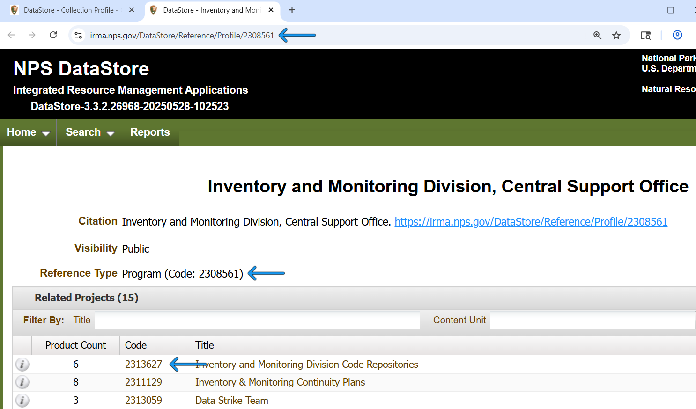

<!-- README.md is generated from README.Rmd. Please edit that file -->

```{r, include = FALSE}
knitr::opts_chunk$set(
  collapse = TRUE,
  comment = "#>",
  fig.path = "man/figures/README-",
  out.width = "100%"
)
```

# NPSdatastore

<!-- badges: start -->
<!-- badges: end -->

The NPS DataStore is the official home of National Park Service (NPS) datasets, publications, and more. Use this package to search the contents of DataStore, download files, and publish new content (write access for authorized NPS users only).

The NPS DataStore is organized into references, which may contain digital files, URLs to external resources, or information about how to locate physical resources that cannot be easily digitized (e.g. museum item, herbarium samples). Every reference also contains metadata, such as a description of its contents and information about its author(s).

There are two special types of references, called *Programs* and *Projects*, that only contain other references. Not all references belong to a Program or a Project, but they are a helpful way to organize things.

*Project* references contain all the references related to - you guessed it - a single project. An example of a Project might be "Amphibian Inventory at Great Smoky Mountains National Park," and it might contain a reference for the final dataset resulting from the inventory, another reference for the protocol that was used to conduct the inventory, and yet another reference for the published report summarizing the inventory results. A reference can belong to multiple Project references.

*Program* references contain multiple Project references, and typically represent a group that is working on similar or related projects. "Great Smoky Mountains National Park Resource Management Team" is an example of a Program that might contain the example Project described above.

## Installation

You can install the development version of NPSdatastore from [GitHub](https://github.com/) with:

``` r
# install.packages("pak")
pak::pak("nationalparkservice/NPSdatastore")
```

## Examples

### Search for references by their ID

Every reference in DataStore has a unique identifer, known as a reference ID. In the DataStore web application,
these IDs can be found at the end of the reference URL, next to the Reference Type, and in the "Code" column of any
tabular list of references:


If you know the reference IDs of the references you are interested in, you can use `search_references_by_id()` to retrieve detailed information about them. This returns a nested list whose names are the reference IDs. If `search_references_by_id()` isn't able to locate some references, it will throw a warning. If it isn't able to locate any references, it will throw an error.

```{r search_by_id}
library(NPSdatastore)
reference_ids <- c(2308561,  # This is a Program reference
                   2171447,  # This is a Project reference
                   2309935)  # This is a reference with files and external links
reference_info <- search_references_by_id(reference_ids)
str(head(reference_info, 2), max.level = 2)
```

If that's overkill, you can get just the basic information as a single tibble:

```{r search_by_id_basic}
reference_info_basic <- search_references_by_id_basic(reference_ids)
str(reference_info_basic, strict.width = "cut")
```


